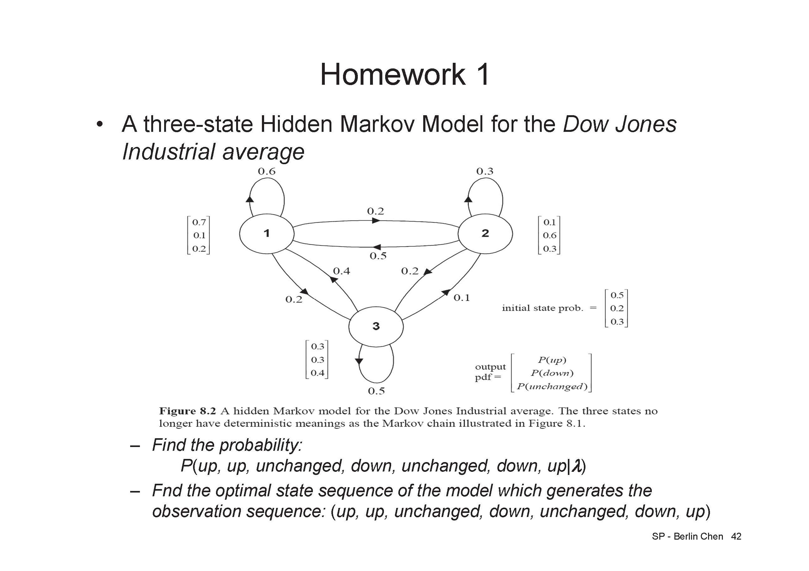

# Course-SpeechProcessing

## homework1 

### -Find the probability P(up, up, unchanged, down, unchanged, down, up|λ)

### -Find the optimal state sequence of the model which generates the observation sequence: (up, up, unchanged, down, unchanged, down, up)

